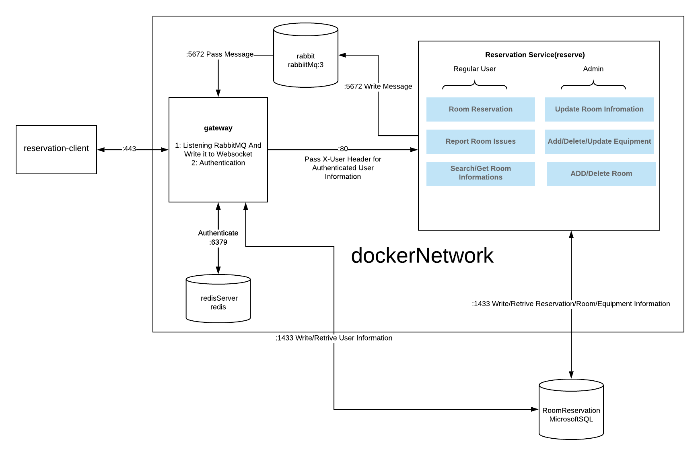
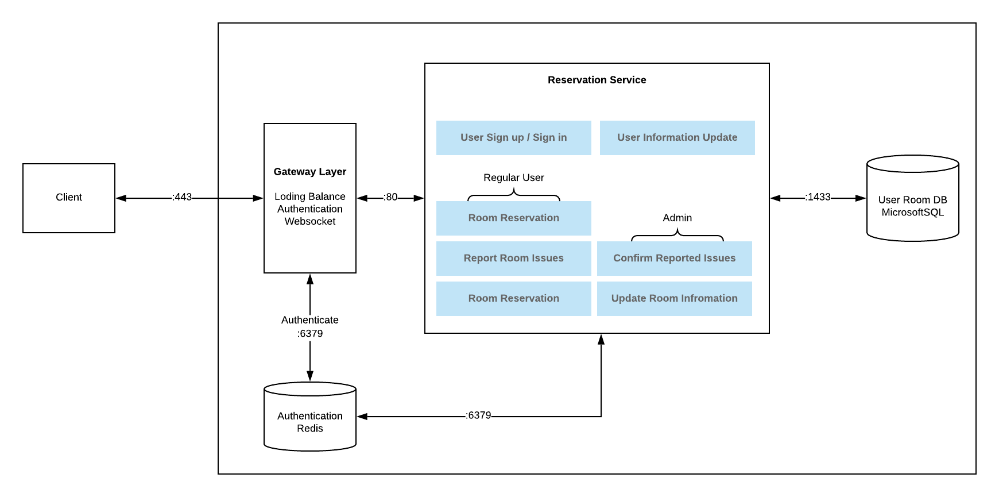
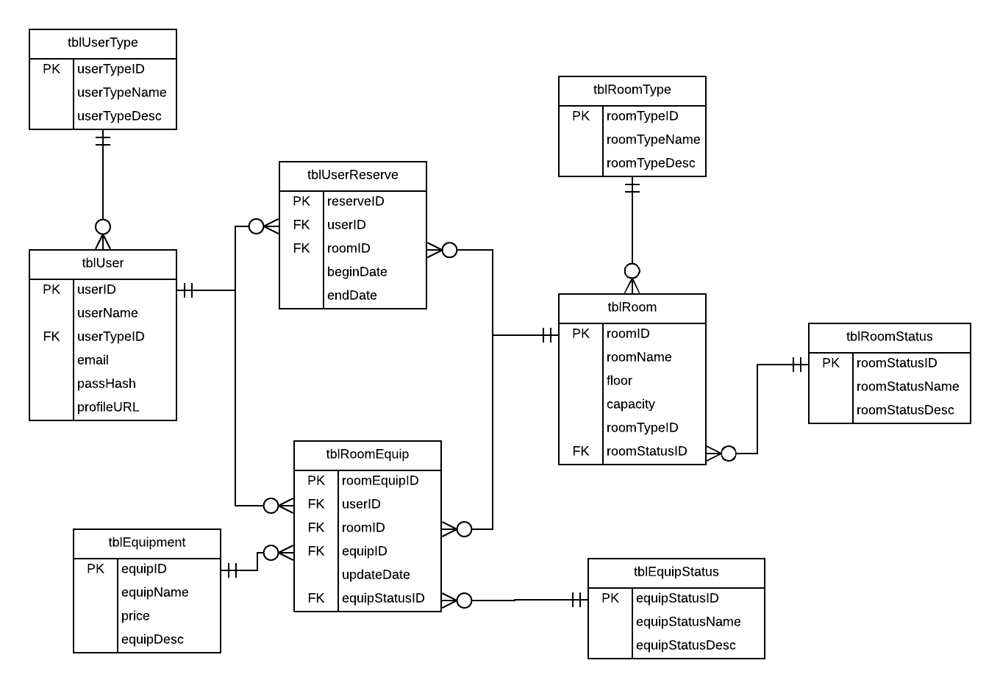

# Room Reservation System
Howard Pu |  Zhiqi Lin

## Introduction
For this project, we are going to implement a Room Reservation System that allows room administrators to manage their meeting/study rooms, which will ease the process of reserving and managing spaces. We want to help organizations like universities or companies to optimize their room usages. 
 
## Why? 
Room management can be painful and frustrating when it comes to large spaces. 
For users who wish to reserve a room for a meeting, without relevant room information provided, it will be hard to identify which room that matches their demand(capacity, equiments, etc.) is available to use. In addition, without a well-designed system to manage a reservation, users can run into conflict or traffic while reserving. In the administrators’ perspective, the system can save their effort from managing the reserving process. With data such as room and equipment status recorded, they will be able to keep track of the utilization of the spaces. Aa single empty conference room can cost an organization $11,781 per year.(Syammank, 2019). A well-designed room reservation system will boost the efficiency of managing spaces, which allows the organization to better utilize its resources and focus on its main goal instead of wasting time on space management. 

### Why do you as developers want to build this application?
We encounter the room reservation problem every day, while the existing solutions don’t really address these issues. For example, the existing library room reservation system at the University of Washington doesn’t provide a live update while students reserve study rooms, which requires students to constantly refresh the page just in case of their rooms get reserved by others. In further, most of the solutions do not include a way for administrators to manage/update rooms in a convenient way. We as developers hope to implement a better solution to help organizations and companies like the University of Washington who have a hard time to utilize and manage their spaces.
 
## Final Technical Description

### Final Infrastucture

### Endpoints, Methods, Description

#### Gateway
**/v1/users**: Signup 

* POST: Write user information to the MSSQL, begin session for the new user

**v1/sessions**: Login

* POST: Authenticate a user in Reddis

**v1/sessions/mine**: Logout

* DELETE: end session for user

**/ws**: Create Websocket for authenticated user

 

#### Reseravation Microservice

**/v1/room**: Manage Room

* GET: search room by querries (roomname, capacity, floor, room type)
* POST: (for admin only) write room information/Add a room to database
* DELETE: (for admin only) delete a room from database

**/v1/reserve**: Manage Reservation

* GET: get all reservation information for the specific user
* POST: create a new room reservation for an authenticated user
* DELETE: cancel a reservation that the user has

**v1/specificRoom**: Manage Equipments in a specific room

* GET: get all equipment in a specific room
* POST: (for admin only) add an equipment to a specific room
* DELETE:(for admin only) delete an equipment in a specific room

**v1/equip**: Manage All the Equipments in the building

* GET: get all equipments in the building
* POST: (for admin only) add an equipment to a database
* DELETE: (for admin only) delete an equipment in the database

**v1/issue**: Manage All the issues in the building

* GET: get all issues based on qurries(all, unsolved, uncomfirmed, solved, comfirmed)
* POST: report an issue
* PATCH: (for admin only) update the issue status(solved / confirmed)

**v1/roomUsedTime**

* GET: get all unavailable timeslot for a room at specific date

 

## Initial Technical Plan
### Initial Infrastucture

### Database
For database selection, we decide to use Redis for client-server communication since this DB has good management on session expiration, and mapping between user and authentication information. And for the user-room database, we decided to use the relational database since the scope of this application is small (in an organization, the volume of transactions for room management is not huge), while accuracy and data integrity does play an important role in the room management.

(Both Diagram can be viewed at https://www.lucidchart.com/invitations/accept/a228470d-93c4-43f9-ad86-142402566017)

### Priority Chart
|Priority | User| Description  |  Implementation |
|---|---|---|---|
|P0 | As a user | I want to search and see which room is available for my own purposes (study, meeting, demonstration, etc.) | The server will receive a **Get** response at /v1/roomSearch, then the server will response as a list of available rooms based on the query|
|P0 |As a user |I want to reserve a room for a specific time | The server will receive a **Patch** response at /v1/roomReserve, then the server will try to update the reserve information in the user-room database and return a reservation result|
|P0|As a person|I want to register as a user for using the reservation system|The server will receive a **Post** response at /v1/register, then the server will try to register the person in the user-room database and return the registration result|
|P1|As an admin|I want to add new rooms or new equipment in a room| The server will receive a **Post** request at /v1/updateStatus, then the server will try to add a room/equipment in the user-room database, add the status of the equip/room and return the update result.|
|P1|As a user|I want to report equipment in a room has issues|The server will receive a **Post** request at /v1/reportIssue, then the server will try to add an issue in the user-room database and return the update result|
|P2|As an admin|I want to confirm the issues and record it in the database|The server will receive a **Patch** request at /v1/issueConfirm, then the server will try to confirm the issue in the user-room database and return the confirmation result|
|P2|As an admin|I want to update an equipment’s status or a room’s status|The server will receive a **Patch** request at /v1/updateStatus, the server will try to update the status of a room/equip in the user-room database and return the update result
|P3|As a user|I want to customize my user information (email, profiles, etc)|The server will receive a **Patch** request at /v1/userUpdate, then the server will try to update user information at the user-room database and return the update result
|P3|As a user|I want to receive notifications when the reserved date is coming|The server will check which rooms are reserved 30 minutes before the start of the reserved date, then send the user the notification based on the given email in the user-room database

 
 

**/v1/userAuth --- P0**

Calling this port will initiate the function fn_getUserPassHash(@email), then the server will validate the hashed password. And if successful, the server will save the session in Redis and return it to the client.

**Post** - Status Code
200: OK: Successfully authenticated.
401: Cannot authenticate the provided credentials
405: Method Not Allowed: Not using POST method 
500: Internal Service Error

 

**/v1/roomSearch --- P0**

Calling this port will initiate the view getAvailableRoom in the user-room database, then return the result from the view.
**Get** - Status Code
200: OK: Successfully find data.
401: Cannot authenticate cookies
405: Method Not Allowed: Not using GET method 
500: Internal Service Error

 

**/v1/roomReserve --- P0**

Calling this port will initiate the store procedure usp_reserveRoom(@userName, @roomName) in the user-room database, then the user-room database will try to reserve the room, return any error, then the server returns the result of the reservation.

**Patch** - Status Code

* 200: OK: Successfully Reserve a room.
* 401: Cannot authenticate cookies
* 405: Method Not Allowed: Not using PATCH method 
* 409: The room has been reserved by others
* 500: Internal Service Error

 

**/v1/register   --- P0**

Calling this port will initiate the store procedure usp_addNewUser(@userName, @email, @passHash, @userTypeName, @profileURL) in the user-room database, then the user-room database will try to add the user, return any error, then the server returns the result of the registration.

**Post** - Status Code

* 200: OK: Successfully register.
* 400: invalid the user’s register information
* 405: Method Not Allowed: Not using POST method 
* 409: The username has been created/used.
* 409: The email has been used
* 500: Internal Service Error

 

**/v1/updateStatus ---P1**

Calling this port will initiate the stored procedure usp_updateEquipStatus or usp_updateRoomStatus in the user-room database, then the user-room database will try to update the status, return any error, then server return the result.

**Patch** - Status Code

* 200: OK: Successfully update.
* 401: Cannot authenticate cookies
* 403: The user type is not admin
* 405: Method Not Allowed: Not using Patch method 
* 500: Internal Service Error

 

**/v1/reportIssue --- P1**

Calling this port will initiate the stored procedure usp_addIssue in the user-room database, then the user-room database will try to add the issue associated to equipments in a room, return any error, then the server returns the result.

**Post** - Status Code

* 200: OK: Successfully reported.
* 401: Cannot authenticate cookies
* 405: Method Not Allowed: Not using POST method 
* 409: Issue reported already
* 500: Internal Service Error

 

**/v1/issueConfirm --- P2**
Calling this port will initiate the stored procedure usp_confirmIssue in the user-room database, then the user-room database will try to record the issue as confirmed return any error, then the server returns the result.

**Patch** - Status Code

* 200: OK: Successfully confirmed the issue.
* 401: Cannot authenticate cookies
* 403: The user type is not admin
* 405: Method Not Allowed: Not using PATCH method 
* 409: Issue has been confirmed
* 500: Internal Service Error

 

**/v1/userUpdate --- P3**
Calling this port will initiate the stored procedure usp_updateUser in the user-room database, then the user-room database will try to update the user and return any error occurs, then the server returns the result.

**Patch** - Status Code

* 200: OK: Successfully update user information.
* 401: Cannot authenticate cookies
* 405: Method Not Allowed: Not using PATCH method 
* 409: username/email cannot be repeated
* 409: Password invalid (need to fit the certain format)
* 500: Internal Service Error

 

### Clients
For the client side, there will be 2 pages - the user profile page and the home page. In the home page, there will be 3 sections: Search/Filter Section, Available Rooms Section, and the User Information(can navigate to the user profile page) Section. 

## Reference
Symmank, Rebecca(2019). “How to Calculate the Cost of One Empty Conference Room.” IOFFICE, www.iofficecorp.com/blog/empty-conference-room-cost.
